<p align="center">
  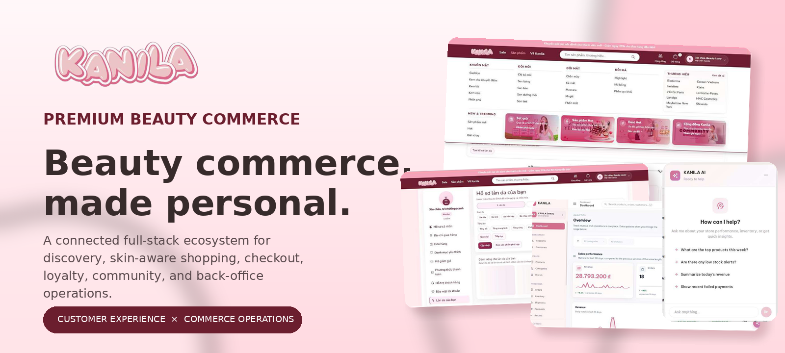
</p>

<h1 align="center">KANILA — Premium E-Commerce Experience</h1>

<p align="center">
  <strong>A beauty-commerce ecosystem designed around customer confidence, personalized discovery, and operational control.</strong>
</p>

<p align="center">
  
  
  
  
</p>

<p align="center">
  <a href="#why-kanila-exists">Why Kanila</a> •
  <a href="#the-product-in-one-view">Product</a> •
  <a href="#customer-experience">Customer Experience</a> •
  <a href="#stakeholder--business-value">Stakeholders</a> •
  <a href="#technology-as-a-business-enabler">Technology</a> •
  <a href="#architecture--commerce-flow">Architecture</a> •
  <a href="#current-scope-vs-next-horizon">Roadmap</a> •
  <a href="#run-locally">Run Locally</a>
</p>

---

## Why KANILA exists

Online beauty retail has a harder problem than simply putting products into a catalog.

A customer buying skincare or makeup is often trying to answer several questions at once: **Is this product right for me? Which variant should I choose? Can I trust the information? Is the promotion valid? What happens after I pay? Can I easily return the order if the product is unsuitable?** At the same time, the business must coordinate product data, inventory, vouchers, orders, payments, shipments, reviews, returns, customer profiles, and internal teams without letting those workflows drift apart.

KANILA was designed to solve both sides of that equation.

> **Product thesis:** a premium commerce experience only works when the customer-facing journey and the operational system behind it share the same source of truth.

Instead of treating e-commerce as a collection of isolated screens, KANILA models the experience as an end-to-end system: **discovery → evaluation → personalization → cart → checkout → fulfillment → after-sales → loyalty → community**, with a connected administrative layer responsible for the business operations that make each stage reliable.

This makes KANILA more than a storefront. It is a **commerce operating model** for a beauty retailer.

---

## The product in one view

KANILA is organized around three connected products:

| Experience | Who it serves | What it is designed to accomplish |
|---|---|---|
| **Customer Storefront** | Shoppers, members, beauty enthusiasts | Reduce discovery friction, improve product relevance, simplify checkout, and keep the relationship alive after purchase. |
| **Operations / Admin Suite** | Merchandising, operations, marketing, support, managers | Create one operational workspace for catalog, inventory, orders, payments, shipments, returns, campaigns, reviews, and performance monitoring. |
| **Commerce Backend** | Both customer and internal experiences | Keep business rules, identity, pricing, stock, orders, and transaction data consistent through a shared API and data model. |

The key design choice is that these are **not separate systems**. The storefront and admin application are different views of the same commercial reality.

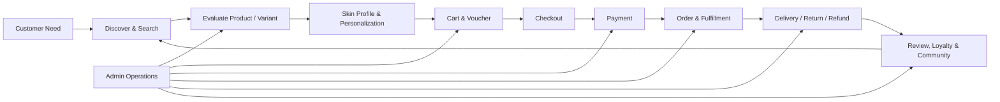
```mermaid
flowchart LR
    A[Customer Need] --> B[Discover & Search]
    B --> C[Evaluate Product / Variant]
    C --> D[Skin Profile & Personalization]
    D --> E[Cart & Voucher]
    E --> F[Checkout]
    F --> G[Payment]
    G --> H[Order & Fulfillment]
    H --> I[Delivery / Return / Refund]
    I --> J[Review, Loyalty & Community]
    J --> B

    K[Admin Operations] --> C
    K --> E
    K --> G
    K --> H
    K --> I
    K --> J
```

---

## Problems KANILA is designed to solve

| Business / UX problem | KANILA response | Intended value |
|---|---|---|
| **Beauty-product uncertainty** — shoppers can see products but still struggle to decide what fits their skin or preferences. | Skin-profile data, structured product attributes, recommendation-ready customer data, related products, favorites, reviews, and brand/category discovery. | Less cognitive load and a more relevant discovery journey. |
| **Too many variants** — color, shade, volume, format, and other SKU-level attributes can create inconsistent selection and stock behavior. | A product/variant model that separates the commercial product from physical sellable variants. | Cleaner catalog operations and more accurate product selection. |
| **Fragmented shopping journey** — search, cart, voucher, payment, tracking, and returns often feel like unrelated experiences. | A connected lifecycle from discovery through after-sales, using a single customer account and order context. | Greater continuity and less friction between purchase stages. |
| **Promotion complexity** — discounts can conflict, expire, be misapplied, or be abused. | Promotion and coupon rules with validity conditions, usage history, and checkout-time validation. | More consistent campaign execution and stronger promotional governance. |
| **Inventory blind spots / overselling risk** | Variant-level inventory, warehouse balances, stock movements, and order-linked inventory logic. | Better stock accuracy and operational confidence. |
| **Operational silos** — teams may manage orders, payment, shipping, reviews, and returns in separate tools. | A unified back-office with shared order, customer, product, and transaction context. | Faster handoffs and fewer context-switching costs. |
| **Weak post-purchase relationship** | Order history, shipment status, returns, reviews, wishlist, loyalty, vouchers, support, and community. | A longer customer lifecycle beyond checkout. |
| **Management lacks a live operational picture** | Dashboard, sales metrics, low-stock visibility, operational status, and an AI-assisted insight surface. | Faster operational diagnosis and decision support. |

KANILA does **not** claim that every desired business outcome has already been measured in production. The product is designed to create the mechanisms that support better conversion, retention, trust, and operating efficiency; those outcomes should ultimately be validated through analytics and user testing.

---

# Customer Experience

## 1. Discovery that feels curated rather than overwhelming

Beauty catalogs become difficult to navigate quickly because shoppers do not naturally think in database structures. They think in **need, body area, brand, concern, trend, occasion, price, and product type**.

KANILA therefore treats discovery as a first-class experience:

- prominent search across product and brand intent;
- category navigation organized around beauty-use contexts;
- filtering by product type, brand, price, and attributes;
- new / trending / hot / sale discovery paths;
- brand-level browsing;
- related-product recommendations;
- responsive layouts designed to preserve the same discovery logic on mobile.

<p align="center">
  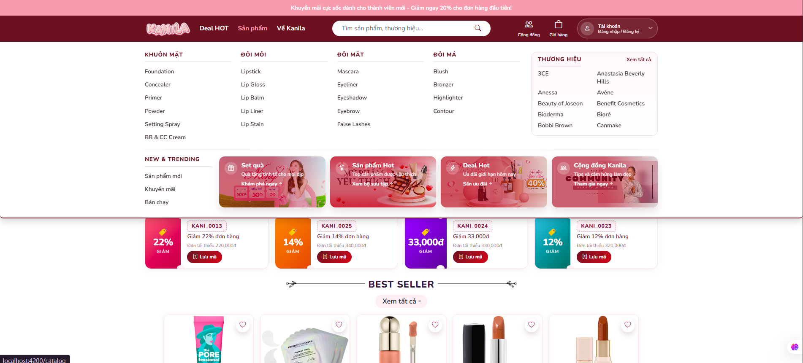
</p>

The objective is not merely to help a user “find an item.” It is to **reduce decision effort while preserving exploration**, which is especially important in beauty retail where browsing itself is part of the purchase experience.

---

## 2. Skin-aware personalization

A generic beauty storefront asks every customer to browse the same catalog. KANILA introduces a **skin profile** as customer-owned preference data that can become the foundation for more relevant recommendations.

The profile captures signals such as skin type, skin characteristics, and user preferences. From a product-design perspective, this matters because it moves personalization away from a one-off campaign and into the user account itself.

<p align="center">
  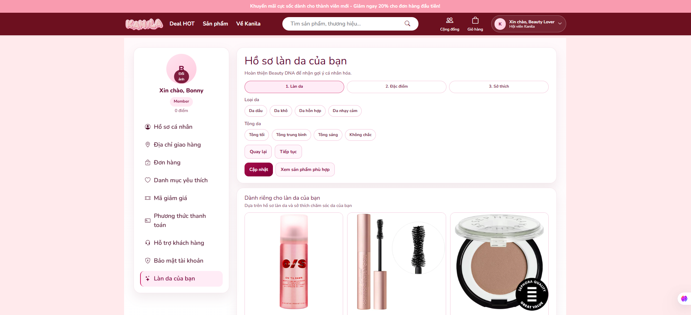
</p>

This creates a foundation for several business capabilities:

- more relevant “for you” product ranking;
- segmentation based on beauty needs rather than only transaction history;
- targeted loyalty and promotional journeys;
- future AI-assisted skincare recommendations;
- a more useful customer profile for support and CRM scenarios.

**Important scope note:** the current project establishes the skin-profile experience and recommendation-ready business flow. Advanced computer-vision diagnosis and fully automated AI skincare routines belong to the future roadmap, not the current core claim.

---

## 3. Product evaluation built around confidence

A beauty product detail page needs to do more than display name, price, and an image. KANILA models information needed to support an informed decision: product attributes, variants, brand context, reviews, related products, availability, and selection state.

<p align="center">
  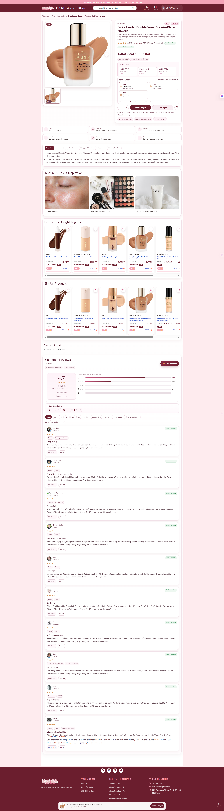
</p>

By separating the product from its variants, the system can support real merchandising needs such as different shades, colors, or volumes without treating each variation as an unrelated product. That design also keeps variant-level stock and order data aligned with what the customer actually selected.

---

## 4. Cart and checkout as a single commercial decision

Checkout is where product experience, pricing, promotions, identity, inventory, payment, and logistics collide. KANILA treats this as a coordinated business workflow rather than a static form.

The customer journey supports:

- cart quantity management;
- variant-aware line items;
- ticket-style voucher selection with real-time eligibility validation;
- recipient and address selection;
- shipping method selection;
- payment method selection;
- order notes;
- order confirmation and invoice context;
- member history and guest-oriented order lookup patterns.

<table>
<tr>
<td width="50%">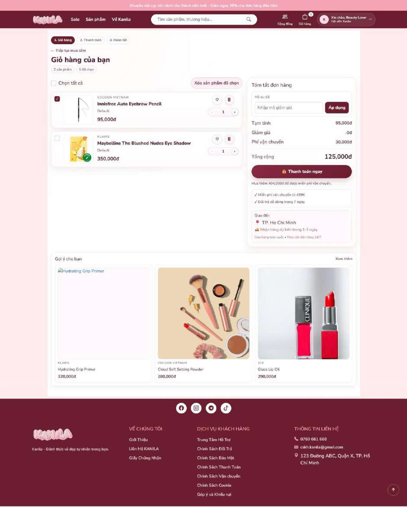</td>
<td width="50%">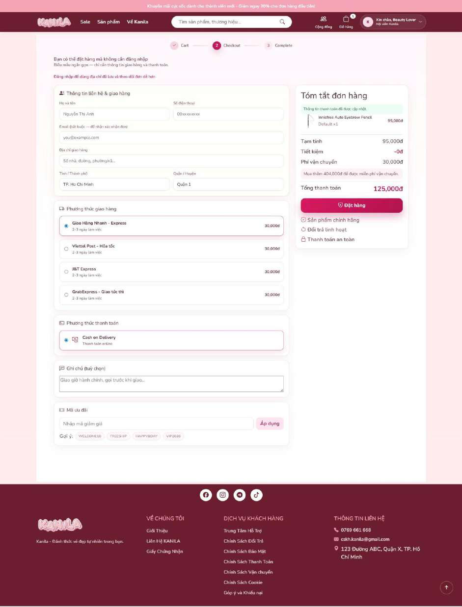</td>
</tr>
<tr>
<td align="center"><sub><strong>Cart:</strong> item, quantity and pricing context remain visible.</sub></td>
<td align="center"><sub><strong>Checkout:</strong> address, shipping, payment and order confirmation are coordinated.</sub></td>
</tr>
</table>

The business value is consistency: the promotion a customer sees, the stock being sold, the amount being paid, and the order created should all describe the **same transaction**.

---

## 5. The experience continues after payment

KANILA intentionally extends the customer account beyond profile settings. Members can access a post-purchase workspace covering:

- order history and order status;
- delivery addresses;
- saved products / wishlist;
- vouchers;
- payment methods;
- customer support;
- account security;
- skin profile;
- return / refund journeys;
- points and membership-tier concepts.

This creates a customer lifecycle rather than a one-time checkout funnel. In beauty commerce, where repeat purchase and replenishment can be important, this continuity is strategically valuable.

---

## 6. Community as a commerce layer

KANILA also explores a community experience with gallery, challenge, profile, and review flows. The purpose is not to add a social feed for its own sake. The community layer can create a bridge between **inspiration, social proof, product discovery, and retention**.

<p align="center">
  
</p>

In future iterations, this layer can support KOC/KOL content, affiliate links, richer review formats, and creator-led discovery while keeping the relationship inside the Kanila ecosystem.

---

# Operations & Admin Experience

A polished storefront can still fail as a business system if the team behind it has poor operational visibility. KANILA therefore gives the administrative experience the same design importance as the customer side.

## One back-office, multiple business functions

The admin suite centralizes:

- customer and account management;
- roles and account status;
- products, variants, categories, and brands;
- order processing;
- inventory monitoring;
- shipment status;
- payment records;
- returns and refund workflows;
- review moderation;
- campaigns and coupons;
- dashboard analytics;
- operational assistance / insight surfaces.

<table>
<tr>
<td width="50%">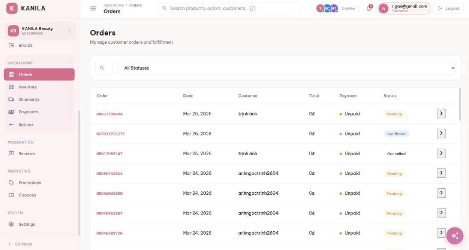</td>
<td width="50%">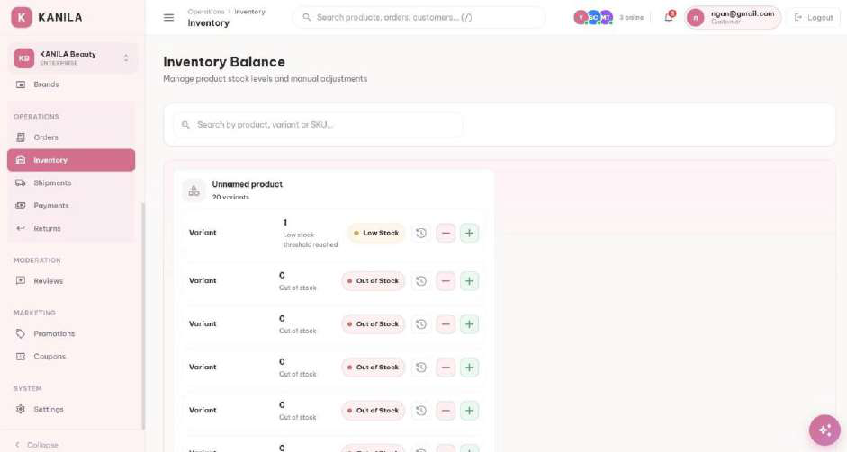</td>
</tr>
<tr>
<td align="center"><sub>Orders remain actionable within a shared operational context.</sub></td>
<td align="center"><sub>Inventory is managed as an operational domain, not just a number on a product.</sub></td>
</tr>
</table>

### Why this matters for stakeholders

An order problem rarely belongs to only one team. A failed payment may become a support case; a delayed shipment may trigger a return; a campaign can suddenly create low stock; a product-data error can affect both customer conversion and warehouse execution. A centralized back-office reduces the need to reconstruct context across disconnected tools.

### Collaboration-aware operations

The admin experience is also designed for **multi-person operations**, with presence indicators, activity-oriented context, and contextual commenting patterns that help administrators understand who is working on what and why a change happened. This matters when order handling, inventory, customer support, marketing, and payment reconciliation are shared responsibilities rather than solo tasks.

The value is practical: fewer duplicate actions, clearer ownership, and less reliance on external chat messages to reconstruct operational decisions.

---

## Decision support instead of raw administration

The dashboard is designed to answer operational questions such as:

- How is revenue trending?
- How many orders are active?
- How large is the active catalog?
- Is anything low in stock?
- What changed compared with the previous period?

<p align="center">
  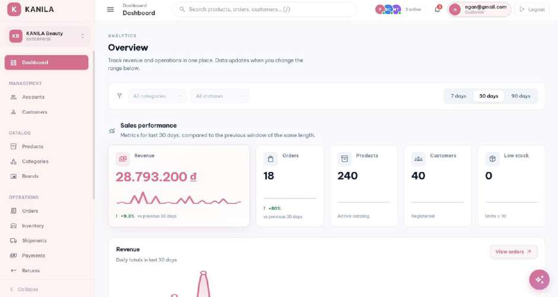
</p>

The goal is to move the admin experience from **record maintenance** toward **operational awareness**.

---

## KANILA AI — an operational insight surface

The project also includes a KANILA AI interface designed around natural-language operational questions. Rather than forcing an admin to navigate several screens for every simple question, the assistant surface is positioned to answer prompts such as:

- “What are the top products this week?”
- “Are there any low-stock alerts?”
- “Summarize today’s revenue.”
- “Show recent failed payments.”

<p align="center">
  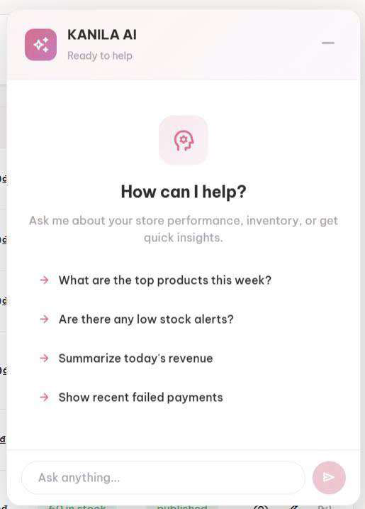
</p>

This is especially meaningful from a stakeholder perspective: AI is most valuable here not as decoration, but as a **query layer over operational information**. The long-term opportunity is to connect it with governed analytics, alerting, inventory forecasting, and campaign performance data.

---

# Stakeholder & Business Value

KANILA was designed around multiple stakeholders rather than only the shopper.

| Stakeholder | Typical friction | How KANILA supports them |
|---|---|---|
| **Customer / Member** | Too many choices, uncertainty about fit, fragmented checkout and after-sales. | Search, filters, skin profile, variants, reviews, wishlist, vouchers, checkout, order history, support, returns, loyalty, community. |
| **Merchandising / Catalog Team** | Complex beauty SKUs, categories, brands, and constantly changing attributes. | Structured product/variant model, category trees, brand management, product admin tools. |
| **Operations / Fulfillment** | Stock mismatch, order handoffs, shipment status, returns. | Inventory domain, order lifecycle, shipment tracking, returns/refunds, shared administrative context. |
| **Marketing / CRM** | Generic campaigns and weak understanding of individual beauty needs. | Customer profile, skin attributes, segmentation-ready data, vouchers, campaigns, loyalty history. |
| **Customer Support** | Hard to diagnose an issue without order/payment/shipping context. | Centralized account, order, payment, shipment, return, and support-related data. |
| **Content / Community Moderation** | Reviews and community content need governance. | Review workflows, moderation status, verified-purchase concepts, community surfaces. |
| **Business Manager** | Raw operational data is scattered and slow to interpret. | Dashboard metrics and an AI-oriented insight interface. |
| **Engineering / Product Team** | Frontend and back-office can diverge as the product grows. | Shared API, modular domain model, role-based access, reusable full-stack JavaScript ecosystem. |

---

# Technology as a business enabler

KANILA uses modern web technology, but the architectural choices matter primarily because of the **business problems they enable the product to solve**.

| Technology | Why it is used in KANILA | Business / experience consequence |
|---|---|---|
| **Angular 20** | Powers both customer and admin applications as reactive single-page experiences. | Search, filtering, forms, cart state, profile updates, and dashboards can feel continuous without a full page reload after every interaction. Modular components also make the product easier to evolve as business flows grow. |
| **RxJS** | Coordinates asynchronous events and data flows in Angular. | Helps keep UI state synchronized when multiple things change at once — for example cart totals, filters, customer state, or admin data refreshes. |
| **Bootstrap 5.3 + responsive custom UI** | Provides a reliable responsive foundation while allowing Kanila’s own design language. | Reduces the gap between desktop and mobile experiences and accelerates consistent delivery across many commerce screens. |
| **Swiper.js** | Supports touch-friendly galleries and content browsing. | Makes image-heavy product discovery more natural on mobile, where visual evaluation is central to beauty shopping. |
| **Node.js** | Runs the backend using event-driven, non-blocking I/O. | Suitable for commerce workloads with many concurrent, short-lived requests such as catalog browsing, cart actions, account lookups, and order-status checks. |
| **Express.js** | Organizes REST API routing, middleware, and business endpoints. | Gives customer and admin apps one controlled gateway to the same business logic instead of duplicating rules in two frontends. |
| **MongoDB / MongoDB Atlas** | Stores flexible document-oriented business data. | Fits beauty catalogs where products and promotions can have heterogeneous attributes, while supporting growth without repeatedly redesigning rigid tables for every new product shape. |
| **Mongoose** | Adds schemas, validation, relationships, hooks, and application-level data rules on top of MongoDB. | Preserves flexibility without sacrificing governance — especially important for orders, customer data, variants, pricing, and promotion rules. |
| **JWT** | Provides stateless authentication and carries identity/role context to protected APIs. | Supports secure customer sessions and clear access boundaries between customer and internal admin actions. |
| **Bcrypt** | Hashes and salts passwords before storage. | Protects customer credentials and supports trust in account-based commerce. |
| **Nodemailer** | Supports transactional email flows. | Enables password recovery, verification, and order-related communication so important lifecycle events are not trapped inside the website. |

The result is a stack chosen around four product qualities: **responsiveness, consistency, flexibility, and operational safety**.

---

# Architecture & Commerce Flow

The repository is separated into three primary modules:

```text
KANILA/
├── backend/   # Commerce API, business rules, authentication, persistence
├── client/    # Customer storefront and personalized shopping experience
└── admin/     # Operations, catalog, inventory, order and analytics workspace
```

At runtime, the system behaves like this:

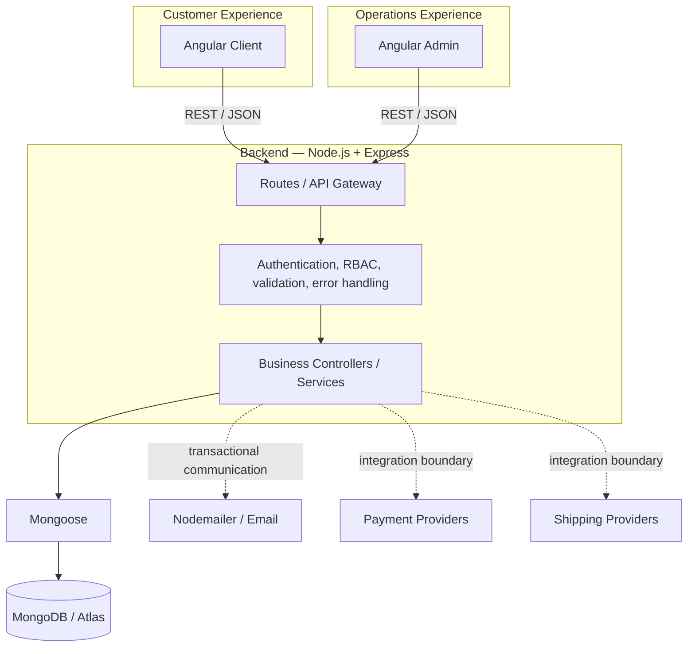
```mermaid
flowchart TB
    subgraph CX[Customer Experience]
      C1[Angular Client]
    end

    subgraph OPS[Operations Experience]
      A1[Angular Admin]
    end

    C1 -->|REST / JSON| API
    A1 -->|REST / JSON| API

    subgraph BE[Backend — Node.js + Express]
      API[Routes / API Gateway]
      MW[Authentication, RBAC, validation, error handling]
      CTRL[Business Controllers / Services]
      API --> MW --> CTRL
    end

    CTRL --> ODM[Mongoose]
    ODM --> DB[(MongoDB / Atlas)]

    CTRL -. transactional communication .-> MAIL[Nodemailer / Email]
    CTRL -. integration boundary .-> PAY[Payment Providers]
    CTRL -. integration boundary .-> SHIP[Shipping Providers]
```

### Why this separation matters

The customer app can optimize for discovery and conversion. The admin app can optimize for dense operational workflows. The backend can enforce the business rules both sides must obey. This is a cleaner scaling path than letting every frontend become its own source of business logic.

---

# Commerce data model: built around the lifecycle, not isolated tables

KANILA’s data design follows the actual life of a commerce transaction:

**Identity → Customer → Catalog → Pricing & Promotion → Inventory → Cart & Checkout → Order → Payment / Refund → Shipping / Return → Engagement → Loyalty**

That sequence matters because each stage creates state that the next stage depends on.

### Catalog & variants

Beauty products frequently contain multiple sellable variations. Kanila separates the base product from physical variants so color, shade, volume, and similar attributes can have their own stock and transactional identity while still belonging to one customer-facing product.

### Pricing & promotion

Promotion rules are modeled as business data rather than hard-coded visual banners. This creates room for eligibility windows, minimum-order rules, customer targeting, usage limits, and coupon history.

### Inventory as a ledgered operation

Stock is treated separately from descriptive product information. Inventory movements can be associated with operational events rather than silently overwriting a single number. This provides a stronger foundation for traceability, replenishment, returns, and multi-location stock.

### Orders as an immutable commercial record

Once checkout becomes an order, the system needs a durable record of what was bought, what price was accepted, how it was paid, where it was sent, and how the fulfillment state changed. That prevents later catalog edits from rewriting the meaning of a historical order.

### Engagement and loyalty

Wishlist, verified-purchase review concepts, loyalty accounts, points, and membership tiers create a data layer for retention — not just acquisition.

---

# Reliability, trust & operational safety

A beauty-commerce experience is only premium if it is dependable.

KANILA therefore includes design decisions aimed at operational safety:

- **role-based access boundaries** between customer and internal administrative capabilities;
- **JWT authentication** for protected API access;
- **bcrypt password hashing** so credentials are never stored in plain text;
- **Mongoose validation** to reject malformed or incomplete application data;
- **centralized middleware/error handling** to reduce inconsistent API behavior;
- **environment variables** for database credentials and runtime secrets;
- **inventory controls** designed to reduce ordering beyond available stock;
- **promotion eligibility checks** before discounts are applied;
- **audit-oriented data structures** for important administrative changes;
- **database write reliability configuration** for transaction-sensitive updates such as payment and stock operations.

These choices are not “backend details” in isolation. Each one protects a stakeholder: the customer, the operations team, finance, support, or management.

---

# UX & visual language

KANILA’s visual identity uses soft pinks and warm neutrals to support a modern beauty positioning while reserving deeper burgundy tones for contrast and hierarchy.

| Role | Example |
|---|---|
| Accent / CTA | `#FFADBE` |
| Soft pastel surface | `#FFD6DE` |
| Light blush surface | `#FFEBEE` |
| Deep brand / emphasis | `#6B1E2E` |
| Primary dark text | `#372B2B` |
| Neutral divider / surface | `#D9D9D9` |
| White base | `#FFFFFF` |

Typography in the project documentation centers on **Nunito**, **Be Vietnam**, and **Be Vietnam Pro** — balancing a soft, approachable brand character with strong Vietnamese readability.

The broader UX principle is consistency: visual polish should make complex commerce workflows feel simpler, not hide complexity with decoration.

---

# What makes KANILA distinctive

### 1. It treats beauty “fit” as product data

The skin-profile concept changes personalization from an advertisement into a persistent customer capability. That is strategically more valuable because it can power recommendations, segmentation, loyalty, service, and future AI features from the same profile.

### 2. Customer experience and operations are designed together

Many portfolio e-commerce projects stop at product → cart → checkout. KANILA extends the system into inventory, payments, shipping, returns, review moderation, promotions, dashboard analytics, loyalty, and operational assistance.

### 3. It models commerce edge cases, not only happy paths

Returns, refunds, failed payments, promotion conditions, stock constraints, role permissions, and auditability are part of the system design. These are the workflows that usually distinguish a demo storefront from a business-oriented platform.

### 4. The architecture is prepared for growth

Client and admin are independently optimized frontends over a shared backend. Catalog, inventory, checkout, order, and customer concerns are kept conceptually separated, allowing future payment providers, logistics services, mobile applications, and analytics capabilities to connect without redesigning the entire product.

### 5. AI is framed around usefulness

The most interesting AI direction in KANILA is not a generic chatbot. It is a pair of practical intelligence layers:

- **customer intelligence** — skin-aware recommendation and future computer-vision assistance;
- **operational intelligence** — natural-language access to store performance, stock, payment, and order insights.

---

# Current scope vs. next horizon

KANILA’s documentation deliberately distinguishes between what the current system establishes and what belongs to the strategic roadmap.

| Current system / established product flow | Strategic next horizon |
|---|---|
| Customer storefront with search, filters, catalog, variants and product detail | AR-powered virtual try-on for lipstick, foundation, eye products, etc. |
| Skin-profile experience and personalization-ready customer data | Computer-vision skincare analysis and fully personalized skincare routines |
| Cart, vouchers, checkout, orders, account, wishlist and post-purchase flows | More payment options such as wallets / BNPL |
| Community and review experiences | Creator / KOC / KOL affiliate social commerce |
| Admin product, category, brand, order, inventory, shipment, payment, return, review, campaign and coupon tools | Deeper ERP / CRM integration |
| Dashboard and KANILA AI operational-assistant interface | Governed BI, demand forecasting, reorder-point and safety-stock models |
| Shared Node.js / Express / MongoDB backend | Real-time logistics API / webhook synchronization |
| Responsive web experience | Native iOS / Android omnichannel experience with synchronized carts and profiles |
| Loyalty-ready data model | Behavioral clustering, conversion prediction and marketing automation |

This roadmap preserves the original product principle: **technology is added when it removes a real customer or business constraint.**

---

# Screenshot Tour

<details>
<summary><strong>Customer account & post-purchase</strong></summary>
<br/>
<table>
<tr>
<td width="50%">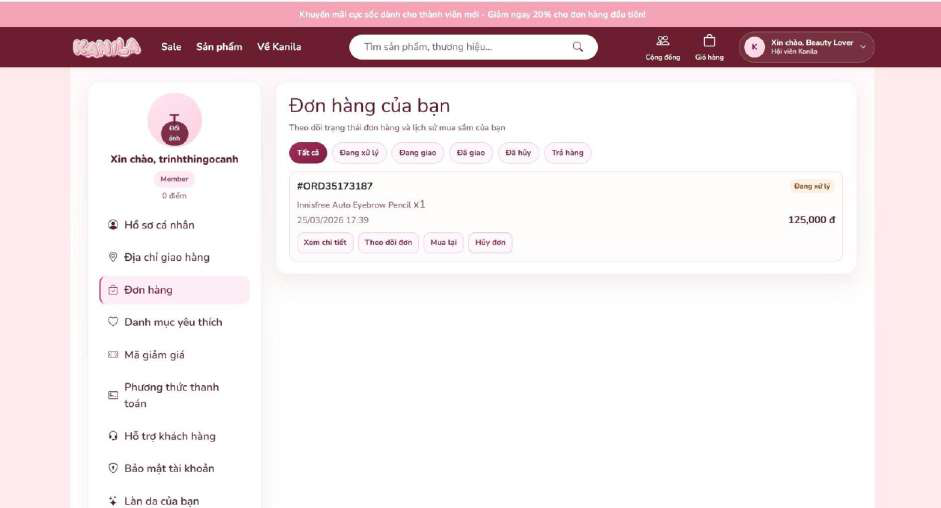</td>
<td width="50%"></td>
</tr>
<tr>
<td width="50%">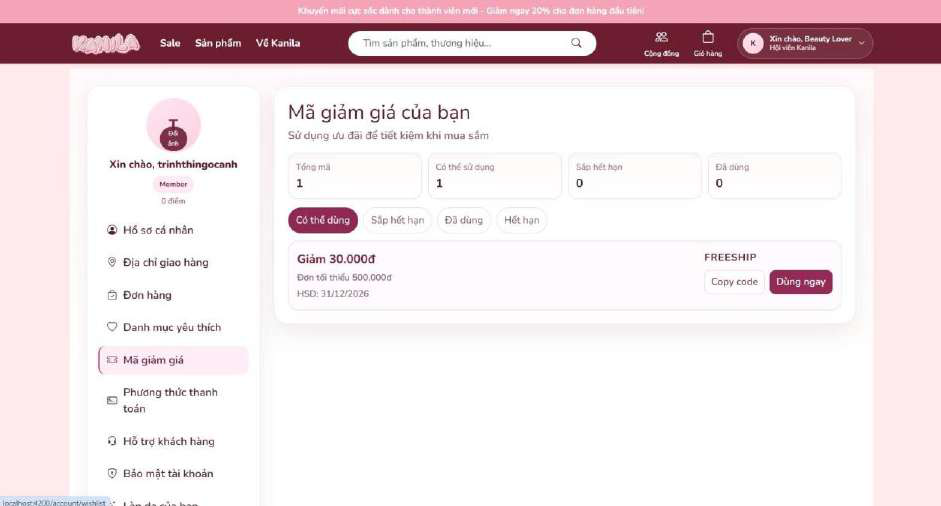</td>
<td width="50%"></td>
</tr>
</table>
</details>

<details>
<summary><strong>Admin catalog & growth operations</strong></summary>
<br/>
<table>
<tr>
<td width="50%">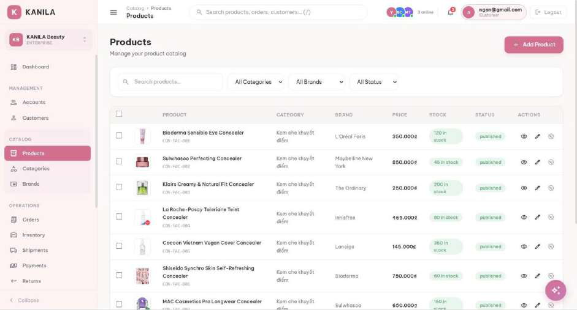</td>
<td width="50%">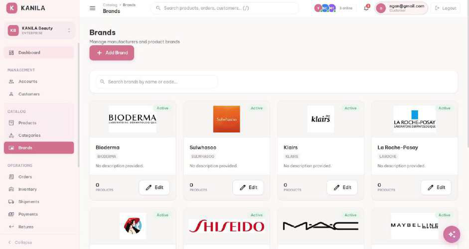</td>
</tr>
<tr>
<td width="50%">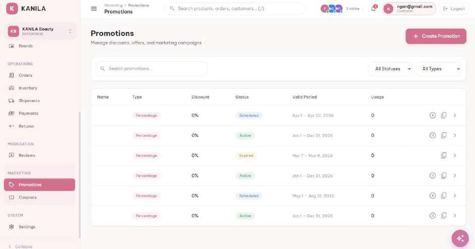</td>
<td width="50%">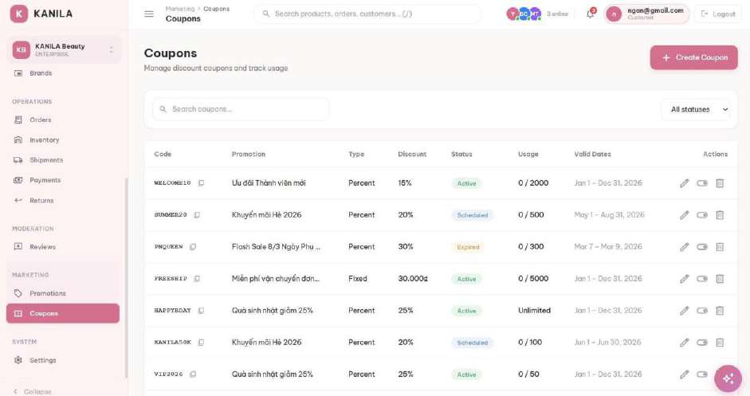</td>
</tr>
</table>
</details>

<details>
<summary><strong>Admin fulfillment, payment & service recovery</strong></summary>
<br/>
<table>
<tr>
<td width="50%">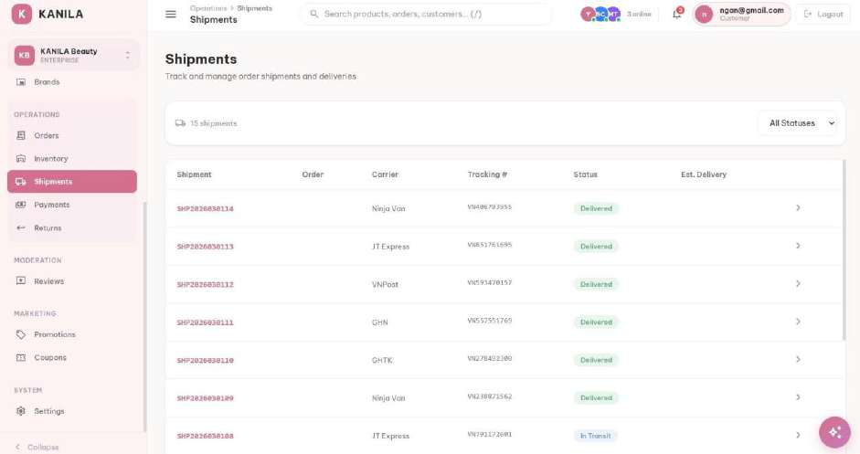</td>
<td width="50%">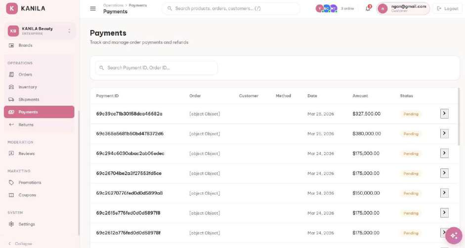</td>
</tr>
<tr>
<td width="50%">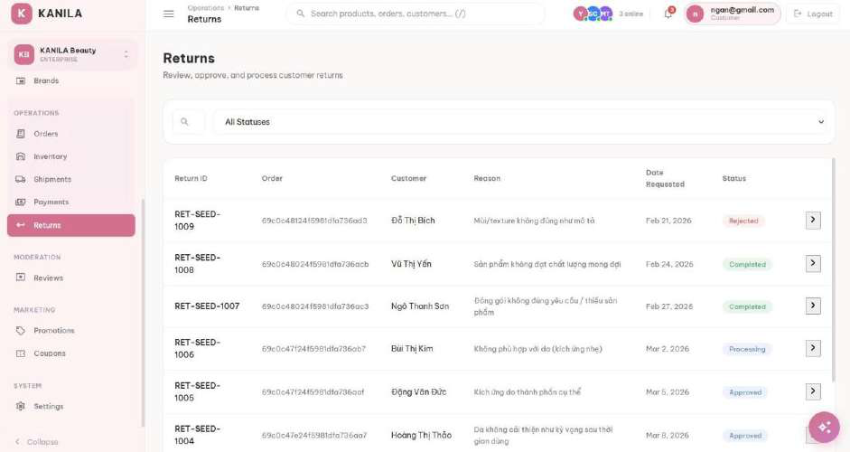</td>
<td width="50%">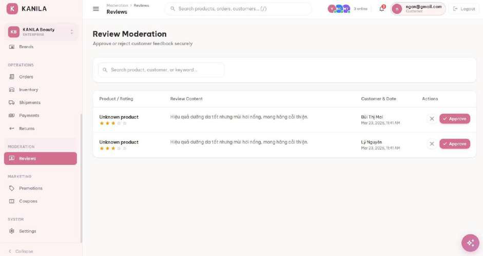</td>
</tr>
</table>
</details>

---

# Run locally

## Prerequisites

- Node.js **18.x or higher**
- MongoDB locally or a MongoDB Atlas connection string
- Angular CLI

```bash
npm install -g @angular/cli
```

## 1. Backend

```bash
cd backend
npm install
cp .env.example .env
npm run dev
```

Configure `.env` with the database connection and any environment-specific secrets required by your implementation.

## 2. Customer storefront

```bash
cd client
npm install
ng serve
```

Default local storefront:

```text
http://localhost:4200
```

## 3. Admin dashboard

```bash
cd admin
npm install
ng serve
```

Default local admin URL:

```text
http://localhost:4201
```

> If both Angular projects default to the same port in your environment, run the admin app with an explicit port such as `ng serve --port 4201`.

---

# Development data & seeding

The backend includes utility scripts for creating a useful development state quickly:

```bash
npm run seed:admin
npm run seed:data
npm run seed:categories:makeup
npm run seed:brands
npm run cleanup:customers
```

These tools are important for more than convenience. Repeatable seed data makes frontend testing, admin workflow testing, onboarding, and demo preparation more deterministic.

---

# Product principles carried through the implementation

1. **Design for a complete customer lifecycle, not a checkout screen.**
2. **Treat personalization as structured data, not only visual recommendations.**
3. **Keep customer and admin experiences specialized while sharing business truth.**
4. **Represent variants, inventory, promotions, payments, and returns as real business domains.**
5. **Use technology to reduce uncertainty, inconsistency, and operational effort.**
6. **Make the roadmap explicit so prototypes and future intelligence are not confused with current capability.**

---

# Project context

KANILA was documented as an **Advanced Business Web Development** project focused on the analysis and development of a beauty e-commerce website. The project work covers business-process modeling, use cases, data-flow analysis, domain/data modeling, customer and admin UI design, backend architecture, and future product directions.

The implementation and this README present that work as a product story: **what the system is for, who it serves, what business constraints it addresses, and why the architecture matters.**

---

# License

This project is licensed under the **ISC License**.

---

<p align="center">
  
</p>

<p align="center">
  <strong>Beauty commerce is not only about selling more products — it is about helping customers choose with confidence while giving the business the control to deliver on that promise.</strong>
</p>
